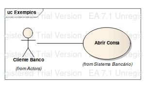

# Casos de Uso

Os diagramas de casos de uso surgiram no RUP, e se referem aos requisitos funcionais, podendo também estar associados à requisitos não funcionais. Ou seja, o objetivo desses diagramas é <b>trazer uma compreensão do que as funcioalidades vão fazer</b>.

Os casos de uso são uma boa forma de documentação para situações onde o cliente não pode estar sempre presente. Vale a pena lembrar aqui que gerar documentação, geralmente serve para <b>comunicação</b>. Então quanto maior a aproximação e disponibilidade do cliente menor a necessidade de documentação. Já para clientes com menor aproximação e menos disponibilidade há uma necessidade maior de documentação.

Para identificar um caso de uso é necessário fazer algumas perguntas e reflexões:

- Qual o contexto do sistema?     
- Quais são as partes de interação do usuário com o sistema?    
- Esse caso de uso que eu fiz traz um <b>resultado observável</b>, ou seja, irá gerar um valor observável?     

Os diagramas de casos de uso vão possuir um elemento chamado ator, que nada mais é do que uma pessoa ou sistema que interaje com o caso de uso. Esses diagramas irão registrar todas as interações que o ator realiza com o sistema. Essas interações ou etapas devem estar escritas na descrição/detalhamento do caso de uso. É importante lembrar que se há só um passo então não é um caso de uso.

<b>ATENÇÃO:</b> Casos de uso e histórias de usuário não devem ser usado juntos como documentação de requisitos, pois não são complementares.

