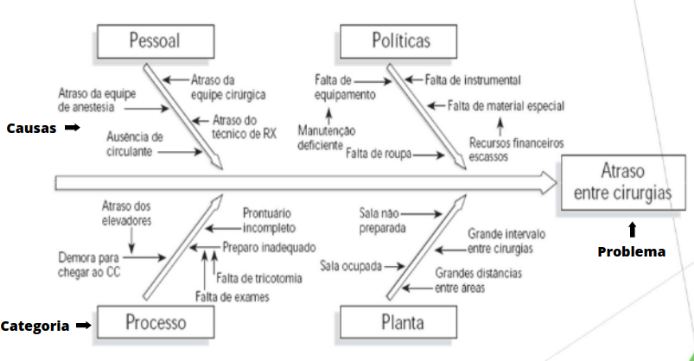

# Problemas e Necessidades

## Problemas

Um tema que precisa ser estudado no início de qualquer projeto de software é a análise do <b>problema</b>.  Uma visão real do problema contribui para compreender a situação claramente, identificar corretamente as necessidades, e assim ser possível propor uma solução coerente.

Lembra que uma coisa muito importante na Engenharia de Requisitos são os próprios requisitos? Para conseguir <b>entender quais são os requisitos fundamentais</b> em um projeto, é necessário primeiramente compreender qual o problema envolvido.

Além disso, a identificação correta do problema <b>evita o retrabalho</b>, pois se construímos uma solução baseado no problema errado, vai ser tempo e trabalho jogado fora. Por mais que a solução atenda corretamente aos requisitos levantados, se esses requisitos foram definidos com base no problema errado, a software não servirá de nada.

É relevante notar que um software é uma solução feita para satisfazer uma necessidade do usuário. Para tornar isso possível em um software é necessário analisar e entender o problema.

Muitas vezes, essa etapa de análise do problema é negligenciada. Somos apressados e queremos trabalhar logo em uma solução. Porém, é meio irônico querer encontrar uma solução para um problema que você ainda nem compreendeu qual é, não?

Para entender o problema podemos fazer uso de algumas ferramentas. A primeira delas é o seguinte framework:

<table>
  <tr>
    <td><b>O problema</b></td>
    <td>descrição do problema</td>
  </tr>
  <tr>
    <td><b>Afeta</b></td>
    <td>que stakeholders são afetados com o problema?</td>
  </tr>
  <tr>
    <td><b>Cujo impacto é</b></td>
    <td>descrição do impacto do problema</td>
  </tr>
  <tr>
    <td><b>Uma solução bem sucedida seria</b></td>
    <td>uma possível solução bem como a lista de alguns benefícios caso ela seja bem sucedida</td>
  </tr>
</table>

Outra ferramenta que pode ser utilizada é o Diagrama de Causa-Efeito. Esse diagrama traz uma descrição clara do problema. Além da identificação das categorias que contribuem para o problema. Dentro das categorias temos as causas que vão contribuir para o problema. E para as causas, também podem ser identificadas sub causas. Na construção desse  diagrama, recomenda-se fazer um brainstorming para identificar as causas.

Assim, ao iniciar qualquer projeto devemos fazer a seguinte pergunta: Qual é o problema que esse software vai resolver? Identificando o problema e bem como as suas causas, é possível realizar um <b>planejamento</b> e <b>priorizar</b> o que deve ser feito para solucionar o problema.

## Necessidades

As necessidades dos usuários em um projeto são muito importantes, pois é a partir delas que devem ser criados os requisitos de software do software a ser desenvolvido. Essas necessidades são identificadas através dos problemas que são levantados anteriormente, precisando estar alinhadas com as restrições do projeto.

É bom ressaltar que as necessidades são diferentes de desejos dos stakeholders. Devemos tomar muito cuidado para não confundir uma desejo com uma necessidade, pois os desejos por vezes não estão alinhados com os problemas nem restrições do projeto. E com isso podem acabar sendo levantados requisitos desnecessários, que gerarão custos e retrabalho, pois não resolvem os problemas reais daquele cliente.

Essas necessidades precisam estar descritas no Documento de Visão, e elas irão guiar a descrição dos requisitos funcionais e não funcionais daquele software. 

Os requisitos de software podem surgir a partir de diversas fontes, e é preciso que o engenheiro de software tenha boas habilidades de comunicação para que seja possível extrair o máximo de informações necessárias de algumas fontes.

Essas fontes de requisitos podem ser:

- O próprio cliente.
- O modelo e plano de negócios.
- Especialistas do domínio do problema.
- A legislação sobre o problema.
- Entre outros.

Para elicitar esses requisitos, algumas técnicas podem ser utilizadas para elicitar esses requisitos, e cabe ao responsável por essa elicitação analisar qual ou quais delas é mais útil para cada fonte. Algumas técnicas de elicitação que podem ser citadas são:

- Workshop de Requisitos.
- Brainstorming.
- Workshop de casos de uso ou de histórias de usuário.
- Entrevistas.
- Questionários.
- Técnicas de imersão.
- Prototipagem.

