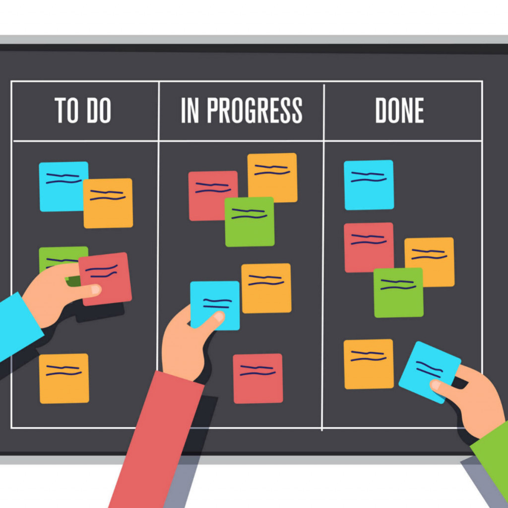

# Processos e Ciclos de Vida

## Principais Processos e Ciclos de Vida da Engenharia de Software

A seguir são apresentados alguns dos principais ciclos de vidas utilizados no desenvolvimento de um produto de software.

### Cascata 

O modelo Cascata surgiu por volta de 1970, quando se buscava uma organização e ordem nos processos de desenvolvimento de software. O Cascata é um tipo de processo preditivo, que segue uma sequência linear de atividades:

1. Primeiro são elencados e acordados os **requisitos**.  
2. Depois é feito o **design** da arquitetura do software. 
3. Logo após é feita a **implementação** do código daquele software. 
4. Depois temos a **verificação** por meio de testes 
5. E por fim temos a etapa de **manutenção** do produto de software. 

Uma das <b>vantagens do Cascata</b> é que é um processo que possui uma gerência bem simplificada, além de ser barato. Pode ser uma boa opção quando o projeto em questão é de pequeno porte.

As suas principais <b>desvantagens</b> estão no fato de que com esse processo a entrega de um resultado é demorada. Só temos uma versão do software no final de todo o processo. Além disso, a engenharia de requisitos só ocorre no início do processo. O desenvolvimento não acompanha as mudanças e evoluções do negócio. Desse modo, esse não é um bom modelo para projetos de médio e grande porte, pois nesses projetos os requisitos mudam frequentemente ao longo do desenvolvimento.

Esse entrega só no final do processo, faz com que erros ou coisas que não estejam de acordo com o que é esperado só sejam identificadas quando o produto está pronto. Isso pode ocasionar retrabalho.

### Espiral

O Espiral surgiu por volta da década de 1980. Ele é um tipo de processo interativo, que se baseia em progressos sucessivos, através de um desenvolvimento cíclico. Esse processo pode ser dividido em 4 tipos blocos de atividades:

1. Definição de Objetivos 
2. Avaliação e Redução de Riscos 
3. Implementação e Validação 
4. Planejamento e Especificação 

Casa fase passa por todos esses blocos de atividades e não existe um limite no número de ciclos que podem ocorrer até o desenvolvimento do software estar finalizado. Um exemplo de como esse processo funciona pode ser observado na figura a seguir:

### Scrum

O Scrum surgiu em meados da década de 1980. Ele é um tipo de processo ágil. O Scrum funciona da seguinte maneira:

 - 
O projeto é dividido em ciclos de tempo chamados de <b>Sprints</b>, que possuem uma séria de atividades a serem realizadas naquele período. 

 - 
Temos o <b>Product Backlog</b>, que é uma lista que mantém o conjunto de funcionalidades que devem ser implementados no projeto. O Product Backlog é atualizado ao longo do projeto de acordo com as demandas. 

 - 
No início de cada Sprint é feita uma reunião de planejamento, chamada <b>Sprint Planning</b>, aonde as tarefas a serem realizadas naquele período são alocadas no Sprint Backlog. 

 - 
Todos os dias durante uma Sprint são realizadas reuniões bem rápidas chamadas <b>Daily Scrum</b>, onde o time trabalhando no projeto informa o que foi feito no dia anterior, quais são os impedimentos, e o que cada um pretende fazer naquele dia. 

 - 
No final de cada Sprint é feita uma reunião para mostrar o que foi implementado naquele período, chamada de <b>Sprint Review</b>. E depois é feita uma reunião chamada <b>Sprint Retrospective</b> que serve para identificar o que funcionou, o que pode melhorar e o que pode ser feito para essa melhoria. Assim termina um ciclo e um novo ciclo é iniciado. 

Uma das principais <b>vantagens</b> do Scrum está nas entregas constantes. Desde cedo é possível ter visualizações do produto antes dele estar pronto. Além disso, alterações e ajustes em relação ao que se espera do produto podem ser feitas ao longo do processo, evitando que sejam gastos tempo e dinheiro em algo que não corresponde ao esperado.

### Kanban

O kanban é um sistema para gerenciamento de tarefas e controle de produção, que é ágil e visual.

Ele funciona através de um <b>quadro</b> que possui uma série de <b>colunas</b> utilizadas para rastrear o status das tarefas. Geralmente, o kanban possui três colunas: <b>to do, in progress e done</b>. Entretanto, as colunas podem ser alteradas conforme a necessidade de cada time.

As tarefas são escritas em <b>cartões</b> e as vezes esses cartões possuem um sistema de cor que serve para diferenciá-los de acordo com quem está responsável pela tarefa, qual o tipo ou prioridade daquela tarefa, etc. Conforme o status de cada tarefa muda, o cartão deve ser movido para a coluna correspondente.

O kanban geralmente é utilizado como ferramenta par auxiliar alguma abordagem ágil, como por exemplo, o SCRUM.

### eXtreme Programing - XP

O XP é uma metodologia ágil de desenvolvimento de software, baseada em uma série de comportamentos e atitudes. Esse metoologia se apoia em valores como simplicidade, counicação, feedback e coragem.

Algumas das boas práticas utilizadas no XP se encontram a seguir:

- 
<b>The Customer is Always Available (O cliente sempre disponível)</b>: É importante que o cliente esteja constantemente disponível para contribuir participando ativamente do desenvolvimento do projeto.

- 
<b>Metaphor (Uso de metáforas no projeto)</b>: Nos pontos chaves do projeto, se faz uso de metáforas, para tornar mais fácil a comunicação da equipe.

- 
<b>Planning Game (Planejando o jogo)</b>: São feitas reuniões entre o cliente e o time para definir as histórias de usuário, e para fazer uma estimatiza do tempo padrão que será gasto nas interações do projeto (cronograma) e especificar quantas histórias de usuário serão implementadas em cada interação.

- 
<b>Small Releases (Pequenas versões)</b>: Ao longo das interações, são entregues ao cliente pequenas versões do software, para que ocorra a validação do que estpa sendo feito. Com isso alterações nos requisitos de software podem ser detectadas com mais antecedencia.

- 
<b>Acceptance Tests (Testes de Aceitação)</b>: No início do projeto o cliente define critérios de aceitação para o software, para garantir que o que é desenvolvido está de acordo com as necessidades do usuário.

- 
<b>Test First Design (Primeiro os testes)</b>: Os testes unitários são utilizados no código so software desenvolvido, e são feitos tendo como base os critérios de aceitação definidos previamente.

- 
<b>Continuous Integration (Integração Contínua)</b>: Todas as partes do software são integradas várias vezes no dia e todos os testes unitários são executados. Desse modo, o código só passa quando obtém 100% de sucesso no testes unitários.

- 
<b>Simple Design (Simplicidade de Projeto)</b>: O código deve sempre estar da forma mais simples e clara, e de acordo com os padrões definidos pelo time de desenvolvimento.

- 
<b>Refactoring (Refatoração - melhoria constante do código)</b>: Conforme novas funcionalidades são adicionadas, o código deve ser refatorado para ficar simples e nos padrões definidos.

- 
<b>Pair Programming (Programação em dupla)</b>: O código é escrito com duas pessoas trabalhando juntas e utilizando o mesmo computador, onde um escreve o código e o outro supervisiona e orienta. Essa prática tem muitos pontos positivos, pois traz o compartilhamento de conhecimento entre o time e nivela o conhecimento técnico dos desenvolvedores.

- 
<b>Move People Around (Rodízio de pessoas)</b>: São feitos revezamentos periódicos das duplas de programação.

- 
<b>Collective Code Ownership (Propriedade coletiva - O código é de todos da equipe)</b>: Com a aplicação do pair programming e do rodízio de pessoas todos do time são responsáveis por todo o código.

- 
<b>Coding Standards (Padronização do código)</b>: Todos utilizam um mesmo padrão para o desenvolvimento do código.

- 
<b>40 Hour Week (Otimizando as jornadas de trabalho)</b>: Trabalhar por longos períodos de tempo não é produtivo, então é necessário evitar que o time fique sobrecarregado. O momento de descanso é importante.

